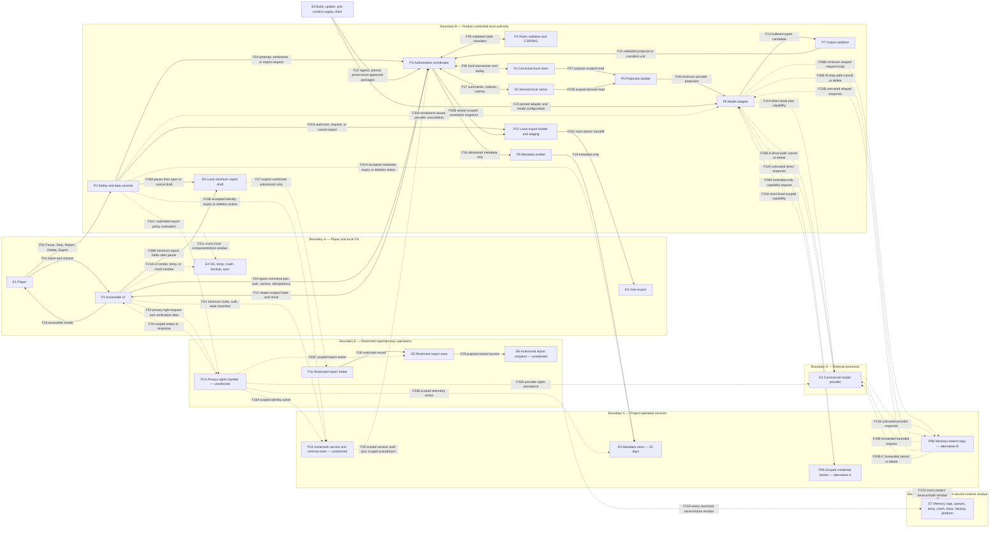

# P0-10 — Visibility- and safety-aware data flow and threat model v0.1

> **STATUS: DESK-AUTHORED REVIEW DRAFT — PROVISIONAL / DEPENDENCY OPEN / NOT ACCEPTED / NOT IMPLEMENTED.** P0-01 is complete and amended P0-03 is accepted. [P0-07 v0.1](P0-07-resolution-lanes-v0.1.md) remains provisional and unaccepted, so this draft cannot satisfy P0-10's dependency or complete P0-10. It selects no provider or runtime, proves no mitigation, accepts no ADR, authorizes no production work, and authorizes no participant work. Recruitment and fieldwork remain NO-GO and G0 remains closed.

- Document ID: `P0-10-DATA-FLOW-THREAT-MODEL`
- Version: `0.1`
- Prepared: `2026-09-25`
- Accountable role: `A3`
- Required independent reviewers: `A6 + A7`
- Evidence boundary: `THREAT/DATA-FLOW SPEC ONLY / NO IMPLEMENTATION, PENETRATION TEST, PROVIDER COMMITMENT, OR LEGAL CONCLUSION`
- Controlling inputs: [project charter](../00-project-charter.md), [decision brief D4/D8/D9/D10/D13/D14/D15](../01-decision-brief.md), [agent contracts](../02-agent-roster-and-contracts.md), [amended P0-03](P0-03-vertical-slice-spec.md), and provisional [P0-07](P0-07-resolution-lanes-v0.1.md)
- Informative sibling input: provisional [P0-09](P0-09-model-turn-choreography-and-sensitivity-v0.1.md)
- Related controls: [milestones and gates](../04-milestones-and-gates.md), [risk register](../05-risk-register.md), [research/evidence notes](../07-research-and-evidence.md), and [ADR register](../../adr/README.md)

## 1. Purpose, dependency, and recommendation

This document makes the candidate Phase 2 data paths, trust boundaries, threats, fail-closed controls, and required evidence reviewable before implementation. It covers visibility, local authority, provider processing, secrets, prompt injection, content boundaries, safety controls, authorization, replay/concurrency, denial-of-wallet, telemetry, export, deletion, temporary files, crash residue, backups, supply chain, and incident response.

The recommended provider-neutral security hypothesis is:

1. keep Pause, Stop, active-play Report, Delete, and Export in a local safety/data control plane that never waits for a model or ordinary turn queue;
2. make one local coordinator the sole Phase 2 authority for authorization, state/version binding, idempotency, admission, deterministic validation, randomness, event application, and projections;
3. remove unauthorized fields before retrieval or request construction and treat every dynamic string and every model/provider/tool output as hostile data;
4. give a model no state-write capability and disable provider tools by default;
5. keep canonical events, narration, indexes, summaries, and caches local until explicit export or deletion; send only allowlisted metadata to project telemetry for 30 days;
6. route centrally funded provider access through a reviewed short-lived credential or minimal relay design—never a static provider secret in a distributed client; and
7. fail closed to local deterministic behavior when authorization, visibility, provenance, provider configuration, retention, price/cap, or validation is unknown.

### 1.1 Dependency state

| Dependency/input | State used here | Consequence |
|---|---|---|
| P0-01 | Complete | Accepted D4/D8/D9/D10/D13/D14/D15 and the charter shape this draft. |
| Amended P0-03 | Accepted research contract | Safety controls, local-first posture, delete/export behavior, and evidence targets are binding inputs. |
| P0-07 | **Provisional / not accepted / incomplete** | Candidate visibility, commitment, correction, and projection semantics are threat-modeled but cannot be treated as accepted authority. P0-10 remains dependency-open. |
| P0-09 | Provisional informative sibling | Its stage IDs, atomic admission/reservation, provider boundary, and deletion epoch are consumed as candidate flows, not implementation evidence. |
| Provider/runtime/identity mechanism | Unselected | Exact endpoint, credential, storage, encryption, callback, cache, region, subprocessors, and deletion behavior remain blockers to provider-enabled integration. |

Any P0-07 change to visibility, reveal timing, commitment, correction, or fallback requires a versioned P0-10 reconciliation. Any provider, runtime, persistence, identity, telemetry, export, backup, or report-channel decision must update the diagram, flow ledger, threat register, and fixtures before acceptance.

### 1.2 Critical credential and content-routing blocker

The centrally funded commercial-API direction and local-first record posture do not by themselves define how a distributed local client obtains provider access. A long-lived or unrestricted provider key in the client, repository, bundle, configuration, URL, command line, crash dump, or export is prohibited.

Before any provider-enabled candidate is certified, one of these architectures must be selected and reviewed:

| Candidate | Project-operated service sees | Required proof | Principal tradeoff |
|---|---|---|---|
| Short-lived scoped provider capability | Authentication, budget, model/configuration, nonce, expiry, and billing metadata; no prompt/response body if the provider supports direct scoped use | Exact provider capability is server-enforced, audience/model/endpoint/tool/token/budget/session/expiry are bounded, replay is rejected, and revocation works | Best preserves the metadata-only project-service boundary, but provider support cannot be assumed. |
| Minimal request relay | The least-privilege prompt and response transiently in memory plus metadata | No body logging, caching, tracing, crash capture, or persistence; strict egress and schema limits; deletion/cancellation behavior; DPA/subprocessor/security review | Compatible with server-held provider credentials, but the project becomes a gameplay-content processor even if it stores no content. |

Calling a relay “stateless” does not make its content processing metadata-only. If neither reviewed architecture is available, provider calls remain disabled and the deterministic fallback is the only permitted path. This is `P010-BLK-01`; it is a provider-integration blocker, not a reason to invent a client secret.

## 2. Method, scope, and claims boundary

The threat review combines STRIDE-style spoofing, tampering, repudiation, information-disclosure, denial-of-service, and elevation-of-privilege questions with the [OWASP 2025 LLM categories](https://genai.owasp.org/llm-top-10/) of prompt injection, sensitive-information disclosure, excessive agency, supply chain, and unbounded consumption, while using [NIST AI 600-1](https://nvlpubs.nist.gov/nistpubs/ai/NIST.AI.600-1.pdf) and [NIST SP 800-218A](https://nvlpubs.nist.gov/nistpubs/SpecialPublications/NIST.SP.800-218A.pdf) as additional risk-management and secure-development method references. These references are not certifications or claims of compliance.

This model covers the accepted Phase 2 direction: one invited adult, one local-authoritative text-only solo session, original/pinned content, a centrally funded commercial model API behind a provider-neutral adapter, local game records, and metadata-only project telemetry. It also defines future-safe interfaces where doing so prevents a Phase 2 shortcut from becoming authority or visibility debt.

The controlling content boundary is adults-only participation with a Teen/PG-13 ceiling: ordinary fantasy violence and mild horror are allowed; explicit sexual content, sexual violence, hate-based targeting, encouragement of self-harm, and graphic torture/gore are excluded. Direct, euphemistic, encoded, and indirect attempts to cross those exclusions are safety-corpus cases, not permission to reinterpret the ceiling. This restates amended P0-03; it does not add a new content policy.

Explicitly outside this version are public anonymous access, minors, arbitrary-network multiplayer, join codes, payments, BYOK, self-hosting, voice, user module imports, published-adventure ingestion, broad user-generated content, public multi-tenant scale, hostile-device tamper resistance, DRM/screenshot prevention, a cryptographic dice claim, and final legal conclusions. These non-goals never permit malformed, unauthorized, over-budget, or visibility-unsafe input to succeed.

### 2.1 Security objectives in priority order

| ID | Objective | Fail-closed requirement |
|---|---|---|
| `SO-01` | Player safety and control | Pause/Stop/active Report preempt generation, timers, randomness, apply, narration, correction, and retry; resume requires explicit player action. |
| `SO-02` | Authority and state integrity | Only deterministic validated commands/events mutate state; model/player/provider/tool text has no authority. |
| `SO-03` | Visibility confidentiality | Consumers receive only fields authorized for their viewer, purpose, stage, and reveal time; non-possession is the primary defense. |
| `SO-04` | Privacy and data lifecycle | Minimize data; honor local export/delete; disclose provider/OS/backup limits; never call pseudonymous metadata anonymous without proof. |
| `SO-05` | Cost and availability control | Authenticate, deduplicate, rate/concurrency admit, and reserve worst-case spend before provider work; safety/data controls remain available during exhaustion. |
| `SO-06` | Auditability and provenance | Preserve correlation, state versions, event ancestry, provider/configuration identity, and source classifications without centralizing raw private play. |
| `SO-07` | Reversibility | Provider/model/runtime changes do not alter canonical schemas or strand local records; deterministic operation remains available. |

### 2.2 Threat actors and environmental assumptions

| Actor/condition | Capability assumed | Boundary |
|---|---|---|
| Curious or malicious player input | Crafts direct/indirect injections, huge/nested input, Unicode/duplicate-field tricks, replays, timing probes, and disallowed content | Player text remains data and receives no authority. |
| Compromised or faulty model/provider/tool | Returns malformed, deceptive, stale, unsafe, secret-seeking, overlong, duplicated, or forged output; may fail after uncertain processing | Output is buffered and independently validated; provider tools are off by default. |
| Honest software defect/race | Reorders callbacks, applies twice, leaks fields, logs bodies, races Stop/Delete/Export, or leaves residue | Transaction and fault-injection evidence is required; prose intent is not a mitigation. |
| Dependency/update/content compromise | Alters SDK, package, model alias, prompt/schema, rules/content object, or distribution | Pin, verify, scan, sign/checksum, and fail certification on drift or unknown provenance. |
| Project operator/telemetry viewer | Can access allowed operational systems and may misuse or overjoin metadata | Least privilege, separation, access audit, retention enforcement, and no raw/private text. |
| Privileged relay/report/identity operator or compromised project service | May inspect transient plaintext, misuse restricted records, enable debug capture, or exfiltrate through allowed egress | No routine body access; isolation and egress restriction; least-privilege, time-bounded, audited break-glass; role separation; incident evidence. A selected relay still has residual plaintext-memory trust. |
| Local malware, OS administrator, or device owner | Reads process memory/local files or tampers with local authority | Residual risk for Phase 2. Local logs are auditable, not neutral or tamper-proof against this actor. |
| External network attacker | Observes or alters traffic, steals/replays credentials, or impersonates endpoints | Authenticated encrypted transport, endpoint allowlists, scoped credentials, replay defense, and no long-lived or unrestricted provider secret in the client. |

The model does not assume the system prompt is secret, that delimiters solve prompt injection, that a model can validate itself, that a local event log is immutable against the device owner, or that a successful local delete erases provider/OS/user-controlled copies.

## 3. Assets and invariant catalog

| ID | Asset | Required invariant |
|---|---|---|
| `AS-01` | Safety/data controls | Reachable by keyboard and screen reader; processed outside the model and ordinary queue; budget/provider failure cannot block them. |
| `AS-02` | Canonical state/events | Exactly-once atomic apply against an expected version; append-only correction/fork ancestry; no narration as source of truth. |
| `AS-03` | Random results | Local authoritative CSPRNG, stable stage identity, at most one bound result per operation, same-identity lookup on uncertainty. P0-11 owns any stronger claim. |
| `AS-04` | Visibility-scoped facts | Storage/query/projection enforcement precedes retrieval; UI, model, cache, error, export, and telemetry never receive an over-broad object. |
| `AS-05` | Player intent and role-play | Local/private by default; provider receives only the minimum authorized slice; project telemetry receives none. |
| `AS-06` | Lines, veils, phobias, and reports | Restricted; compile only the minimum model policy tags; never send reasons or report text to a model or normal telemetry. |
| `AS-07` | Provider credentials and authorization | No static client secret; capability/relay is scoped, revocable, non-loggable, and separated from content and telemetry keys. |
| `AS-08` | Provider request/response | Non-authoritative, purpose/visibility scoped, endpoint/configuration bound, and subject to disclosed external retention. |
| `AS-09` | Central operational metadata | Closed allowlist only; no raw/excerpted/private content, free-form provider errors, credentials, tool values, or private-text hashes; 30-day TTL. |
| `AS-10` | Export | Explicitly requested, authorized, visibility-scoped consistent snapshot; no secret/config/internal field; separate user copy after handoff. |
| `AS-11` | Delete semantics | Tombstone/epoch first; cancel work; remove every product-controlled local copy/derivative; late completion cannot write, render, cache, summarize, retry, or rehydrate. |
| `AS-12` | Rules/adventure/provenance packages | Pinned/versioned/verified; `P0-08-pre` unknown/quarantined content excluded from prompts, caches, fixtures, and runtime. |
| `AS-13` | Cost/availability | One atomic worst-case reservation across turn/session/principal/account scopes; every cap finite; all attempts and fixed fees reconciled. |
| `AS-14` | Invite, authentication, and adult assertion | Minimum linkable data only; trusted session authorization is distinct from client claims; no exact birth date or identity document by this draft. |
| `AS-15` | Restricted report record | Local minimum draft first; external submission requires explicit confirmation; separate access, retention, deletion/right-request, and legal-hold policy. |
| `AS-16` | Content safety ceiling | Adults-only audience, Teen/PG-13 ceiling; every excluded category remains excluded under direct, euphemistic, encoded, or indirect attempts without bypassing Stop/Report or creating an unintended state transition. |

## 4. Data, provenance, and visibility classes

P0-07 disclosure classes (`PUBLIC_BEFORE_CHOICE`, `PUBLIC_BEFORE_RANDOMNESS`, `PRIVATE_COMMITTED`, `PUBLIC_AT_RANDOMNESS`, `PUBLIC_AFTER_APPLY`, and `AUDIT_RESTRICTED`) describe **when a field may be revealed**. The following P0-10 classes describe **where it may flow, persist, and be deleted**. Every concrete P0-12 field must carry both dimensions; neither substitutes for the other.

| Class | Examples | Provider | Project telemetry | Baseline lifecycle |
|---|---|---|---|---|
| `PUBLIC_STATIC` | Approved rules subset, schema, persona policy, original public setting facts, provenance-safe templates | Only when required for the call | Version IDs only | Versioned package; release/change policy applies. |
| `CANONICAL_AUTHORITY` | Events, state, commitments, stage/result identities, resource deltas | Minimum projected fields only; never write access | IDs, versions, enum outcomes/counts only | Product-controlled local store until export/delete. |
| `PUBLIC_GAMEPLAY` | Revealed state, player-visible dice, applied result, exact narration | Purpose-scoped input/result | No raw text/value | Local until export/delete. |
| `PLAYER_PRIVATE` | Free-form intent, backstory, unrevealed player-specific data | Only minimum authorized call payload | Prohibited | Local until export/delete; omit before unauthorized retrieval. |
| `GM_PRIVATE` | Hidden facts, unrevealed branches/payloads, private commitment fields | Prohibited in this baseline; only an accepted, versioned purpose change may revisit this rule | Prohibited | Visibility-separated local store until reveal or delete. |
| `RESTRICTED_SAFETY` | Lines, veils, phobias, boundary details | Minimum compiled policy tag only when necessary; raw reason/detail prohibited | Prohibited | Local, access restricted, delete with session unless separately and explicitly submitted as a report. |
| `RESTRICTED_REPORT` | Minimal report text/contact/follow-up fields | Prohibited | Separate report system only, never normal telemetry | Recipient, access, retention, deletion/legal-hold behavior remain an operational/qualified-review blocker. |
| `IDENTITY_INVITE` | Minimum invite/contact handle, authentication state, entitlement, adult assertion, scoped account/session linkage | Prohibited | Rotating purpose-scoped pseudonym only; no contact value or credential | Mechanism and exact retention are unselected; minimize and delete under the accepted identity/privacy policy. |
| `AUDIT_SECURITY` | Defect/correction detail, provider request ID, security incident evidence | Only request ID/status needed for provider inquiry | Minimal typed metadata under separate access | Retain only under accepted incident/reconciliation policy; do not use as a gameplay-content backdoor. |
| `OPERATIONAL_METADATA` | Pseudonymous correlation IDs, stage/status/timing/token/cost/configuration enums | Provider returns usage/request metadata | Allowlisted; 30 days | TTL enforced and evidenced; linkability assessed. |
| `CREDENTIAL_SECRET` | Provider/telemetry keys, capability tokens, signing keys | Only the target endpoint receives the scoped credential | Prohibited | Approved secret store, least privilege, rotation/revocation; never export. |
| `USER_EXPORT` | User-selected, visibility-scoped session package | Prohibited | Export event metadata only | Product temporary copy deleted after atomic handoff; destination copy is user-controlled. |
| `QUARANTINED` | Unknown provenance, pasted published modules, unresolved `P0-08-pre` objects | Prohibited | Quarantine status only | Isolated from prompt, cache, fixture, export, and runtime; delete under quarantine policy. |

Identifiers, IP addresses, device facts, provider request IDs, and stable pseudonyms may still be personal or linkable data; this draft never labels them anonymous by convention.

Flow/persistence class and P0-07 reveal time are not privacy-sensitivity labels. Every P0-12 field and derivative must also carry one of these orthogonal privacy classes:

| Privacy class | Meaning |
|---|---|
| `NONPERSONAL_STATIC` | Pinned rules, schema, and provenance-safe static material with no person/session linkage. |
| `LINKABLE_PERSONAL` | Contact, network/device, invite, account, session, or pseudonymous data that can identify or single out a person directly or by combination. |
| `POSSIBLY_SENSITIVE_PERSONAL` | Role-play, inferences, safety preferences, reports, or other content that may reveal health, sexuality, beliefs, ethnicity, trauma, or similarly sensitive facts even when not requested. |
| `AUTH_CREDENTIAL` | Password/authenticator/invite secret, session credential, capability, key, or other security secret. |
| `DERIVED_INHERITED` | Summary, embedding, cache, index, screenshot, log, crash record, or inference that inherits the strictest applicable source class. |

`PLAYER_PRIVATE`, `GM_PRIVATE`, `RESTRICTED_SAFETY`, and `RESTRICTED_REPORT` may therefore also be `LINKABLE_PERSONAL` or `POSSIBLY_SENSITIVE_PERSONAL`; “public” gameplay means visible within the authorized session, not public-web or deidentified data.

## 5. Logical components and trust boundaries

| ID | Component | Trust rule |
|---|---|---|
| `E1` | Player | Authenticated/authorized for the session but all free text and client claims remain untrusted. |
| `P1` | Accessible local UI/renderer | Renders only a server/coordinator-created projection; never hides secrets with CSS, DOM state, ARIA, or client-side filtering. |
| `P2` | Local safety/data control plane | Handles Pause/Stop/active Report/Delete/Export independently of model/turn queue and has no gameplay-rule discretion. |
| `P3` | Authoritative coordinator | Owns auth context, state/version, idempotency, concurrency/admission/reservation, linearization, and event transaction. |
| `P4` | Deterministic rules validator and CSPRNG | Reconstructs authority from pinned catalogs/current state; accepts no model-supplied rule math or random result. |
| `D1` | Canonical local store | Visibility- and retention-separated events/state/narration plus correction ancestry; least OS privileges. |
| `D2` | Derived local stores | Indexes, summaries, caches, WAL/journal, temp, and crash artifacts; every derivative is inventoried and deletable. |
| `P5` | Projection/context builder | Reads only purpose-authorized fields; creates a new minimum projection before retrieval/request construction. |
| `P6` | Model adapter/orchestrator | Non-authoritative; closed schema; provider tools off; buffers output and exposes typed results only to validators. |
| `P7` | Output/stream validator | Validates whole proposal or complete safe release unit; uncertainty withholds output and invokes deterministic fallback. |
| `P8` | Metadata emitter | Constructs telemetry from a compile-time/runtime allowlist; drops the event if a field is not allowed. |
| `P12` | Local export builder and staging | Accepts only an authorized, viewer-scoped, version/epoch-bound snapshot; inert-encodes and stages it before atomic user handoff. |
| `P9A` | Scoped credential broker | Alternative A only: accepts metadata, returns a short-lived bounded capability, and never receives prompt/response bodies. |
| `P9B` | Minimal content relay | Alternative B only: transiently processes minimum request/response bodies; it is a content processor even with no body persistence. |
| `E2` | Commercial model provider | External processor with independent cache/log/application-state/human/subprocessor/region behavior; exact facts are a gate. |
| `D3` | Project metadata store | Metadata only, access-controlled, 30-day TTL; no gameplay-content recovery path. |
| `E7` | Project/restricted-service runtime residue | Memory, access/security logs, queue, temp, crash, trace, backup, or platform residue for every project/restricted service and store; a relay makes this boundary content-sensitive even when body persistence is prohibited. |
| `D4` | Local report draft | Minimum player-entered report fields; no automatic transcript, hidden state, safety preference, provider response, or diagnostic attachment. |
| `P10` | Invite/auth service and minimal store | Abstract boundary only; exact mechanism is unselected. Supplies trusted auth/entitlement context and a scoped pseudonym, never gameplay content. |
| `P11` | Restricted report intake | Separate from gameplay, provider, and telemetry; accepts only a user-confirmed submission under a disclosed policy. |
| `D5` | Restricted report store | Access-restricted record with independent retention, deletion/right-request, incident, and legal-hold rules still open. |
| `E6` | Authorized report recipient | Purpose-bound human or operational role; exact recipient and response process are unselected. |
| `P13` | Privacy-rights handler | Separate unselected workflow for proportionate verification, scoped search/action, provider assistance, and response; it is not normal gameplay or telemetry. |
| `E3` | User export destination | Outside product control after handoff; Delete session does not silently remove it. |
| `E4` | OS/runtime/backup/sync environment | May retain temp, swap, crash, journal, or backup residue; capability and limits must be tested and disclosed. |
| `E5` | Build/update/content supply chain | Dependencies, SDK, model configuration, prompt/schema/catalog/adventure packages, signing/checksum and provenance. |

### 5.1 Level-1 data-flow diagram

Provider paths A and B are mutually exclusive architecture alternatives, not permission to enable both or to race providers. In A, `P9A` sees metadata and returns a capability; the model adapter then sends content directly to the provider. In B, `P9B` handles plaintext request/response bodies transiently and therefore is a project-operated content-processing boundary whose runtime residue must be reviewed. A selected path must keep the same call identity, visibility scope, budget, endpoint/configuration, and deletion/cancellation record. `D3` remains metadata-only in either path. `F21L`, `F21S`, and `F21R` are explicit boundary-wide wildcards: they apply to every named component and store inside B, C, and E respectively, including coordinator, rules engine, projection, validators, controls, emitters, credential broker, identity, metadata, report, and privacy-rights processing—not merely the nodes most likely to persist data. The provider's independent cache/log/human/subprocessor residue remains inside the E2 external-processing gate. The `F30`–`F34` arrows represent best-effort cancellation, accepted lifecycle policy, and scoped request/status contracts—not proof of external erasure or legal applicability. Dotted identity, report, privacy-rights, and provider arrows cross unresolved or separately governed boundaries and do not authorize implementation.

## 6. Boundary-crossing flow ledger

| Flow | Payload and classification | Required checks before crossing | Destination must never infer |
|---|---|---|---|
| `F01` | Free text/choice; remains `PLAYER_PRIVATE`; only a minimum purpose-scoped projection may cross `F08` | Size/encoding/nesting limits; display as data; no authority | Actor, rule, cost, target, or visibility from prose alone |
| `F02` | Control enum plus minimum session/auth context | Dedicated keyboard/screen-reader route; local dispatch; no model | A reason for Pause/Stop; gameplay state from a report |
| `F03` | Typed command, actor/session, auth context, expected version, idempotency key | Authenticate/authorize; dedupe; queue/rate/concurrency; schema/canonical decode | Client authority or current state from claimed fields |
| `F04` | Preempt/epoch/export intent | Linearize against apply; Delete tombstone first; reauthorize export/delete | Rule outcome or consent to resume |
| `F05` | Validated command/result/event group | Catalog/provenance/phase/resource/visibility/version checks; atomic apply | Missing rule math from narration/model output |
| `F06` | `CANONICAL_AUTHORITY`, narration, correction ancestry | Transaction, checksum/version, visibility and retention tags | Silent overwrite or a second apply on replay |
| `F07/F07B` | Purpose-scoped canonical or derived fields | Data-layer authorization, inherited privacy/retention tags, provenance, and reveal-time predicate before read | Hidden fields from later local filtering or broader scope from a summary/cache |
| `F08` | Minimum prompt/context; possibly scoped private content | Call-purpose allowlist; omit secrets/quarantine/report text; budget/token cap | Permission to retain, train on, or broaden use |
| `F09A/F10A` | Auth/budget/model/session metadata to broker; short-lived scoped capability back to adapter | Authenticate client; bind audience, endpoint, model, tools, token/spend, nonce, expiry; broker body-capture canary | Gameplay content or a reusable provider secret |
| `F11A/F12A` | Minimum direct request body plus capability; untrusted direct provider response | All `F08` checks; exact provider configuration; size/time limits; buffer output; no free-form error propagation | Validity, safety, authority, or permission to exceed the capability |
| `F09B/F10B` | Minimum body plus auth/budget metadata to relay; bounded request forwarded to provider | All `F08` checks; no body logging/tracing/cache/crash capture; isolation, egress allowlist, operator access controls | Metadata-only project processing or authority to broaden the body/model/tool/cap |
| `F11B/F12B` | Untrusted provider response through relay to adapter | Size/time limits; buffer; typed parsing; no debug/body capture or free-form error propagation | Validity, safety, authority, or billable completeness |
| `F13/F14` | Typed candidate proposal or validated narration unit | Closed schema; reject duplicate/unknown fields; local rehydration/validation; complete-unit release | State mutation, hidden data, or a new rule/result |
| `F15/F16` | Viewer-scoped public projection/render | Apply-before-narrate; output escaping; accessibility-tree review | Fields omitted by CSS/DOM hiding or unsafe markup |
| `F17` | Local derived summary/index/cache | Same visibility/retention tags; provenance; deletion epoch | New authority or broader visibility than sources |
| `F18/F19` | `OPERATIONAL_METADATA` allowlist | Construct from typed fields only; no raw/free text/hash/secret; TTL tag | Permission for broad/cross-purpose identity joins or a claim of anonymity; scoped pseudonyms and access data remain potentially linkable |
| `F20A/F20B/F20C` | Authorized export request/cancel; viewer-scoped consistent snapshot; inert staged `USER_EXPORT` handoff | Reauthorize; freeze version/epoch; source through coordinator; scope fields; neutralize active content; recheck epoch; atomic move | Raw-store access, hidden/report/secret fields, or product ability to delete the user-controlled destination |
| `F21A/F21L/F21S/F21R` | UI plus **every named component/store** in local authority B, project services C, and restricted operations E: possible memory, render, log, queue, trace, temp, journal, crash, staging, or backup residue | Inventory each component/store individually; minimize; disable body capture; encrypt/ACL where appropriate; lifecycle disclosure and deletion tests; unknown residue blocks that path | Immediate/complete erasure, zero plaintext memory, or metadata-only relay operation the product cannot prove |
| `F22/F23` | Executable/configuration/content packages | Pin/checksum/signature/SBOM/provenance; version compatibility; rollback | Trust from repository location or provider alias alone |
| `F24/F25` | `IDENTITY_INVITE`: minimum invite/contact handle, auth/entitlement, adult assertion; trusted session context plus scoped pseudonym | Minimize; authenticate; bind actor/session/audience/expiry; avoid exact birth date/ID document; separate credentials from telemetry | Gameplay content, broad identity profile, age assurance, or authorization from a client claim |
| `F26A/F26B/F27` | Control plane opens/cancels a paused draft; UI supplies size-limited, enumerated `RESTRICTED_REPORT` fields; only explicit confirmation submits externally | Pause and authorize first; field/type/size limits; local privacy/residue controls; preview/confirm; no automatic transcript/hidden state/safety detail/provider output/diagnostic attachment | Report text/contact from the control enum, consent to submit from opening/editing, or consent to reuse in gameplay/telemetry |
| `F28/F29` | Restricted report record and purpose-bound recipient access | Separate auth/rate/access/audit; accepted notice, retention, deletion/right-request, incident, and legal-hold policy | Ordinary gameplay access, normal telemetry use, or silent deletion/retention assumptions |
| `F30A/F30B-*` | Tombstone-aware local cancellation plus selected-path provider/relay cancellation or deletion request | Bind request/call/epoch; authenticate; best-effort cancel; record typed status only; never claim provider erasure from local success | Rollback of an earlier atomic apply, absence of billing, or guaranteed external deletion |
| `F31A/F31B/F31C` | Accepted metadata/identity expiry or deletion action; submitted-report policy evaluation | Tombstone-aware scoped identifier; accepted retention/delete/right-request/legal-hold rules; no session-content rehydration | One uniform delete rule across legally/operationally distinct records or silent report erasure |
| `F32/F33*/F34` | Minimum privacy-right request/verification data, scoped actions across identity/telemetry/report/provider records, and status response | Proportionate verification; purpose-bound search; role separation; disclosure/retention rules; no new unnecessary personal data | Applicability, entitlement, or a request result before qualified policy and source-specific completion evidence |

## 7. Lifecycle, safety, export, and deletion semantics

### 7.1 P0-09 stage-to-boundary map

| Stage | Security/data responsibility | Failure default |
|---|---|---|
| `D00` | Observe/delete epoch before admission and at every side-effect boundary | Advance tombstone, reject new work, cancel, purge; never rehydrate. |
| `S00` | Observe Pause/Stop/active Report independently of ordinary queue/provider | Linearize control; halt downstream work; explicit resume only. |
| `S01` | Authenticate/authorize session and actor; canonical-decode; size check; dedupe; queue/rate/concurrency admit | Local typed rejection; zero provider call/gameplay mutation. |
| `S01A` | Atomically reserve finite worst-case turn/session/principal/account cost | Local deterministic path if cap/pricing/reservation is absent or insufficient. |
| `S02/S03` | Read one state version; produce minimum projection; bind prompt/schema/model/cache/tool configuration | `STOP_VISIBILITY_RISK` or `STOP_CONTRACT_DEFECT`; provider tools remain empty by default. |
| `M04/M05/M10/M12` | Send only admitted call payload under one bound identity/configuration | Maximum one mutually exclusive proposal successor; withhold and fall back on uncertainty. |
| `V11/E20` | Reconstruct authority locally; validate state/provenance/visibility; disclose/confirm stakes | Model output never fills an authoritative blank. |
| `E30/R31/E32/W33/E34/E35` | Bind stage identity, obtain at most one result, close windows, atomically apply, then expose | Same-identity lookup on uncertainty; no reroll, duplicate apply, or pre-apply narration. |
| `N40/V41/F42` | Provider sees applied public/authorized delta only; complete response/unit validation precedes release | Suppress unsafe/uncertain prose and render deterministic public result. |
| `B50` | Derived data inherits source visibility/retention; deletion epoch checked before every write | Failure leaves canonical events authoritative; no block to safety/delete/export. |
| `S60` | Reconcile actual usage/reservation; emit allowlisted metadata; close/orphan status | Missing usage remains flagged/held; never log content to reconcile. |

### 7.2 Pause, Stop, and active Report linearization

`S00` has a local monotonic control sequence and an atomic linearization point against the `E34` apply transaction:

- If Pause, Stop, or active Report commits first, no later randomness, apply, narration, repair, retry, summary, or model/tool call may begin or commit. Best-effort cancellation is sent, and late completions are discarded.
- If an atomic `E34` event group committed first, preserve that canonical state; do not silently roll it back. The control immediately blocks later stages and narration, and the UI truthfully shows that the checkpoint had already completed before the halt.
- A result obtained but not applied remains bound to its original stage, is not rebound/rerolled, and follows the accepted pause/correction contract on explicit resume.
- Active Report first performs Pause, then opens a separate minimum-data report draft. It never auto-attaches a transcript, hidden state, safety preferences, provider response, or diagnostic bundle.
- Opening or editing the local draft is not submission. Only a separate explicit confirmation may cross `F27`; submitted reports follow their disclosed restricted-record policy and are never reintroduced into gameplay, model context, normal telemetry, or automatic incident bundles.
- Resume is a new explicit player action, reauthorized against current state/control sequence. Model text, a timeout, reconnect, or UI refresh can never resume play.

Provider cancellation is best effort and does not imply provider erasure or absence of billing. Safety processing remains available during provider, telemetry, storage-reconciliation, and budget failure.

### 7.3 Export contract

The default candidate is `PLAYER_VIEW_EXPORT`: an authorized, versioned consistent snapshot of exactly what the player was allowed to see, including stable event ordering and original narration. A possible `FULL_AUDIT_EXPORT` remains unsupported until P0-07 accepts its post-session spoiler, private-payload, and audit policy.

Export must:

1. reauthenticate/authorize and bind the viewer, session, state version, visibility policy, and deletion epoch;
2. run locally without a provider call;
3. exclude unrevealed payloads, raw safety preferences, reports, internal prompts/raw provider responses, credentials, request IDs not intended for the user, telemetry, tombstones, and administrator metadata;
4. neutralize active HTML/Markdown/formula/URL/path content rather than exporting an executable view;
5. write into product-controlled temporary storage, recheck epoch/version, then atomically move to an explicitly selected destination; and
6. include a manifest with export type, schema/content versions, creation time, visibility scope, event range, and integrity checksum.

Delete cancels and purges an unfinished product-controlled export. Once the atomic move completes, the destination is a user-controlled copy and is not silently deleted by Delete session. Offer export before final delete confirmation; after the delete tombstone commits, the deleted session cannot be exported or resumed.

### 7.4 Delete-session state machine

`ACTIVE → DELETE_CONFIRMATION_PENDING → TOMBSTONED → PURGING → LOCAL_DELETED_EXTERNAL_EXPIRY → TOMBSTONE_EXPIRED`

Opening the confirmation enters `DELETE_CONFIRMATION_PENDING`, locally pauses and freezes admission of new gameplay work, and may be cancelled without deletion. Accepting the final confirmation synchronously advances the deletion epoch and commits `TOMBSTONED` in the same atomic operation; there is no durable confirmed-but-not-tombstoned gap. The atomic tombstone/deletion-epoch advance is the delete linearization point. After it:

1. reject new commands, provider calls, status redelivery, retries, summaries, exports, and resume attempts;
2. cancel queued/local work and best-effort cancel provider/tool work;
3. require every worker/callback to compare its captured epoch with active session status before any content/session write, render, gameplay telemetry emission, cache/index/summary update, or retry;
4. remove product-controlled events, narration, commitments, snapshots, indexes/embeddings, summaries, caches, queues, diagnostics, unsubmitted local report drafts, temporary/export staging, crash attachments, and per-session keys;
5. handle central correlatable metadata, explicitly submitted restricted reports, billing/security evidence, provider state, OS residue, and backups exactly as each accepted retention/deletion/right-request/legal-hold policy permits—never by silent assumption;
6. prevent restore/reinstall/cache/status lookup from reviving data; a restore must consult tombstones before materializing a session; and
7. report local completion, any failed purge item, user-created exports that remain, external/OS residual categories, and their known/unknown expiry honestly.

A tombstone contains only a non-content, nonreversible session reference; deletion epoch/time; component purge status; and expiry. It is not a content pointer, identity record, or recovery key. Its duration, central placement, linkability, and legal basis remain open for A7/qualified review. If purge verification fails, expose `DELETE_INCOMPLETE` and continue safe retry/escalation; never show success merely because the session disappears from the UI.

After tombstoning, no new gameplay/session telemetry is admitted. A separately accepted, tombstone-aware reconciliation update may complete billing/usage status for an already-sent provider call using only its existing non-content call identity and typed usage/status; it cannot read or recreate deleted session content, emit a new session join, or extend retention beyond the accepted linkability/TTL policy. Unknown or disallowed reconciliation data stays unresolved rather than reopening the session.

No application-created backup of gameplay content is admitted in the Phase 2 baseline until restore-after-delete and purge/key-erasure behavior is accepted and tested. OS/cloud backup, journal, swap, or crash residue outside product control must be minimized and disclosed; local deletion cannot promise immediate physical erasure the platform cannot prove.

If Delete races an active Report, the tombstone cancels and purges any unsubmitted local draft and still prevents gameplay resurrection. A report that already crossed the explicit `F27` submission point is a separate restricted record: session Delete must apply its disclosed independent deletion/right-request/legal-hold policy and report the outcome honestly rather than silently erasing it or claiming it was erased.

`TOMBSTONE_EXPIRED` is allowed only after purge completion and after every product-controlled late-arrival, callback, queue, retry, cache, restore, backup, credential, and provider-status source is expired or cryptographically unable to rehydrate the session. The underlying session identifier is never reused. Unknown stale-source or restore windows keep the tombstone active; expiry is not a timer chosen for convenience.

## 8. Control and invariant catalog

| ID | Requirement | Required evidence before implementation acceptance |
|---|---|---|
| `DF-INV-01` | Every command/query/export/delete carries actor, session, authorization context, expected version, idempotency identity, canonical request identity, and control/deletion epoch as applicable. Reuse of a key with a different canonical body returns typed `IDEMPOTENCY_CONFLICT` and opens no new cost/apply path. | Complete positive/negative actor × session × operation matrix plus same-key/different-body parallel tests. |
| `DF-INV-02` | Unauthorized fields are absent before retrieval or consumer access; no UI/model/export filters an over-broad object. | Unique-canary and structural projection tests across payload, DOM/accessibility tree, cache, error, log, and export. |
| `DF-INV-03` | Every derivative inherits the strictest audience/privacy/retention/delete classification of its sources. | Summary/index/cache/embedding/temp/crash inspection and deletion inventory. |
| `DF-INV-04` | A reveal transition requires its authored trigger and applied event; narration never reveals or creates it. | State-machine tests over every P0-07 temporal class. |
| `DF-INV-05` | No model/provider/cache/tool/UI component can directly append/apply an event, choose authority, or generate authoritative randomness. | Capability graph and schema-valid unauthorized-output tests. |
| `DF-INV-06` | Provider requests use a stage-specific field allowlist and exact endpoint/model/configuration; missing or drifted facts block the call. | Serialized-request snapshots, configuration attestation, and drift fault tests. |
| `DF-INV-07` | Raw provider token deltas never reach a player surface; each released unit is complete and validated. | Adversarial prefix/late-secret streaming tests and UI capture. |
| `DF-INV-08` | Central telemetry accepts no prompt, role-play, narration, hidden fact, result/tool value, free-form error, credential, or private-content hash. | Schema deny tests and canary scan of every sink, SDK log, APM trace, console, and crash path. |
| `DF-INV-09` | Pause/Stop/active Report preempt every stage before a provider dependency and block work according to the linearization rule. | Fault injection immediately before/during/after every irreversible boundary. |
| `DF-INV-10` | Delete advances its epoch/tombstone before cancellation or erasure. | Transaction-order test plus crash/restart at every delete step. |
| `DF-INV-11` | Every queued/in-flight completion rechecks deletion/control epochs before any side effect. | Delayed/orphan callback tests for each P0-09 model/tool/maintenance stage. |
| `DF-INV-12` | Restore, reinstall, retry, cache, provider status redelivery, and maintenance cannot resurrect a deleted session. | Tombstone-aware restore and late-provider-response tests. |
| `DF-INV-13` | User-created exports are separate and disclosed; Delete does not claim to erase them. | Export-before-delete and delete-during-export tests plus UI copy review. |
| `DF-INV-14` | Default export contains no unrevealed, report-restricted, credential, tombstone, or operational field and cannot execute active content. | Field-matrix, injection, archive/path, and accessibility review. |
| `DF-INV-15` | A provider call is admitted only under reviewed training, retention, cache, human-access, region, subprocessor, deletion, and contract controls. | Exact terms/configuration snapshot and A3/A7/qualified review record. |
| `DF-INV-16` | Long-lived provider secrets never enter the client, repository, prompts, URLs, process arguments, logs, telemetry, crash data, or exports. | Secret scan, binary/config inspection, extraction attempt, rotation and revocation drill. |
| `DF-INV-17` | Authentication, dedupe, bounded concurrency/queue/rate checks, and worst-case atomic spend reservation precede every provider call. | Parallel/replay/property tests and one-unit-below-budget race. |
| `DF-INV-18` | Missing authorization, classification, provenance, state/schema version, price/cap, or provider configuration fails closed. | Mutation/fuzz suite asserting zero call, roll, cost, or state mutation. |
| `DF-INV-19` | Report content never silently enters gameplay, model context, telemetry, or ordinary crash bundles. | Report-flow data map and sink canaries. |
| `DF-INV-20` | Pseudonymous/linkable telemetry is not called anonymous or deidentified without documented analysis. | Data inventory, joinability review, key-rotation and access evidence. |
| `DF-INV-21` | This draft introduces no public/minor workflow or exact-birthdate/identity-document collection. | Product/data-schema review; any change returns to D9 and qualified review. |
| `DF-INV-22` | Restricted operator access is purpose-bound, least-privilege, time-bounded, and audited; no one self-approves an independent gate. | Role/access matrix, elevation records, periodic review, separation-of-duty test. |
| `DF-INV-23` | Provider/tool/model/configuration drift stops new calls rather than weakening controls or silently failing over. | Pin/alias/deprecation/region/cache/tool drift simulations and rollback evidence. |
| `DF-INV-24` | Quarantined/unknown provenance data cannot enter runtime, prompt, cache, fixture, export, or generated package. | Provenance denylist/canary tests and artifact manifest review. |
| `DF-INV-25` | Invite/auth/adult-assertion data is minimal, provider-prohibited, separately retained, and represented in telemetry only by a rotating purpose-scoped pseudonym. | Field inventory, retention/delete test, cross-purpose join test, and exact-DOB/identity-document negative test. |
| `DF-INV-26` | If a relay is selected, no operator has routine request/response-body access; any emergency access is least-privilege, time-bounded, separately approved, audited, and followed by incident evidence review. | Role/egress matrix, debug-capture deny tests, JIT break-glass drill, access-log review, and memory/plaintext residual-risk disclosure. |
| `DF-INV-27` | Export content reaches the user destination only through the local authorized snapshot, inert staging, epoch recheck, and atomic handoff path; the safety control plane only requests or cancels it. | Source-to-destination flow trace plus hidden-field, active-content, crash, and Delete-race tests. |
| `DF-INV-28` | Every content-bearing local/project process and selected relay has its memory/log/trace/temp/crash/backup residue inventoried; unreviewed residue blocks that path. | Process/sink inventory, body-capture canaries, crash/dump inspection, and purge/restore evidence. |
| `DF-INV-29` | Post-tombstone reconciliation is limited to an already-sent call's existing non-content identity and typed usage/status, cannot rehydrate content or create a new join, and obeys the accepted TTL/linkability policy. | Late-usage/status tests with content/session stores removed and central sink inspection. |
| `DF-INV-30` | Final delete confirmation atomically tombstones; tombstone expiry requires purge completion and expiry or cryptographic unreadability of every stale source, and session identifiers are never reused. | Confirmation/admission race tests, stale-source inventory, restore/late-callback tests, and identifier-reuse negative test. |
| `DF-INV-31` | Privacy/right requests use a separate proportionately verified, purpose-bound workflow spanning identity, telemetry, report, and external-processor records without unnecessary new personal data. | Request-source matrix, impersonation tests, minimization review, and source-specific completion/status evidence. |

## 9. Threat register

Severity is inherent planning severity, not measured residual risk. Residual ratings remain `UNKNOWN` until implementation and independent evidence exist.

| ID | Threat and affected asset | Severity | Required mitigation and proof | Residual/open boundary |
|---|---|---|---|---|
| `T01` | Spoofed actor/session, IDOR, confused deputy, or unauthorized export/delete/report access exposes or mutates another scope (`AS-02/04/10/11/14/15`) | Critical | Derive identity/role from trusted auth context; authorize every operation; bind actor/session/version/key; deny absent/mismatch; exhaustive negative matrix | Identity/invite mechanism unselected; future multiplayer is separate. |
| `T02` | Same/different-key replay, same key with a different body, parallel submission, stale callback, or double spend applies/calls twice (`AS-02/13`) | Critical | Bind key to actor/session/state/control epoch/canonical request identity; atomic dedupe; typed conflict on mismatch; one admitted state slot/bounded concurrency; optimistic version; exactly-once apply; worst-case reservation; randomized interleavings | Distributed exactly-once is not claimed; idempotent effect is required. Raw/private body digests never enter central telemetry. |
| `T03` | Direct/indirect prompt injection in intent, name, backstory, authored/retrieved text, summary, tool result, or provider error alters policy (`AS-02/04/12`) | Critical | Dynamic text is always data; projection before retrieval; no autonomous tools; closed schema; local authority rehydration; hostile corpus; no quarantine input | Delimiters/system prompt are defense-in-depth only; model remains probabilistic. |
| `T04` | GM/player/restricted information leaks through prompt, stream, cache, UI/ARIA, error, timing, telemetry, or export (`AS-04/05/06/09/10`) | Critical | Physical omission at data access; purpose scopes; cache partition; complete-unit validation; public reason families; unique canaries across every sink | Timing/length side channels and implementation bugs remain possible. |
| `T05` | Model/provider/tool forges rule ID, DC, actor, tool result, event, or authority using schema tricks (`AS-02/03`) | Critical | Canonical decode; reject duplicate/unknown/extra fields; strict limits; reconstruct authority/current values locally; no model write capability | P0-12 concrete schemas and fuzz implementation remain open. |
| `T06` | Duplicate/substituted randomness, timeout reroll, provider racing, or result selection undermines fairness (`AS-03`) | Critical | Authority-side CSPRNG; stable operation ID; at most one bound result; same-ID status lookup; retain accepted feature rolls; no provider race | Local device owner can tamper; P0-11 owns stronger trust claim. |
| `T07` | Model/content/classifier bypasses Pause/Stop/Report or emits disallowed content (`AS-01/06`) | Critical | Dedicated local accessible control; preemption; explicit resume; output uncertainty suppresses; deterministic safe response; fixed safety corpus | Classifiers are probabilistic and never the sole control. |
| `T08` | Stop/Delete races atomic apply and causes hidden mutation, rollback, or misleading state (`AS-01/02/11`) | Critical | Defined control/apply linearization; preserve earlier atomic apply; block later work; epoch at every side effect; boundary fault injection | UX wording and concrete transaction primitive remain open. |
| `T09` | Large/replayed input, retries/failover/tool loops, stolen token, or log/disk flood creates denial-of-wallet/service (`AS-01/13`) | High | Pre-call byte/token/nesting limits; auth/rate/queue/concurrency; atomic finite reservation; one successor; tools off; output/time caps; kill switch | Numeric limits and availability target remain open; safety/delete/export cannot be shed. |
| `T10` | Delete hides UI entry but late work, cache, summary, restore, or provider result recreates data (`AS-11`) | Critical | Tombstone first; cancel; epoch checks; full derivative inventory; key deletion where accepted; restore-aware tombstone; delayed callback/restart tests | Provider/OS/user copies can outlive local purge and must be disclosed. |
| `T11` | Export leaks hidden/report/secret fields, writes active content, or races Delete (`AS-04/06/07/10/11`) | High | Player-view default; fresh authorization; consistent snapshot; field allowlist; inert encoding; staging + epoch check + atomic move | Full-audit export unsupported pending P0-07; user copy outside control. |
| `T12` | Provider/cache/relay training, retention, human access, region, or subprocessor behavior differs from assumption (`AS-05/06/08`) | Critical | Exact endpoint/model/config review; contract/DPA; store/cache settings; terms snapshot; drift block; honest disclosure and deletion limits | No provider selected; local deletion cannot erase external systems. |
| `T13` | SDK/access/APM/console/crash/database logs capture raw play, private facts, errors, keys, or stable joins (`AS-05/06/07/09`) | Critical | Allowlist at serialization; arbitrary strings prohibited; body logging off; sink inventory/canaries; access/TTL enforcement | Vendor defaults and platform crash behavior remain unknown until chosen. |
| `T14` | Provider/telemetry/signing secret is extracted from client, repo, bundle, process, log, or export (`AS-07`) | Critical | `P010-BLK-01`; approved secret store; short-lived scoped capability/relay; strict egress; scan/rotate/revoke; audience/nonce/expiry | Credential architecture unselected. |
| `T15` | Compromised dependency, SDK, update, prompt/schema, model alias, or content package changes behavior (`AS-08/12`) | High | Lock/checksum/signature/SBOM/provenance; secret/vulnerability scan; pin resolved model/config; compatibility check; rollback | Build/runtime choice and update-signing implementation remain open. |
| `T16` | Player/model output becomes HTML/Markdown/URL/path/terminal/formula injection in UI or export (`AS-10`) | High | Treat strings as text; context-sensitive escaping; no active HTML; URL/path allowlist; CSP where applicable; fuzz UI/export/ARIA | Exact renderer/export format is unselected. |
| `T17` | Local file, memory, journal, temp, swap, crash, backup, or sync exposes or corrupts session (`AS-02/04/05/11`) | High | Least OS permissions; safe temp; encryption/ACL where appropriate; no app backup until accepted; inventory/purge/restore tests | Device owner/admin/malware remains outside protectable Phase 2 boundary. |
| `T18` | Report path overcollects, auto-attaches secrets, is spammed, or conflicts with deletion/legal hold (`AS-01/06/11/15`) | High | Pause first; local minimum draft; separate explicit submission; minimum enumerated fields; explicit excerpt consent; separate auth/rate/access/retention; no model/telemetry | Recipient, notice, retention, deletion/right-request, follow-up and legal-hold policy remain open. |
| `T19` | Local audit/event record is altered or operator denies action, producing false trust claims (`AS-02/03/09`) | High | Correlation/causation/provider IDs; append-only ancestry; checksums and replay evidence; access audit | Local Phase 2 is “auditable,” not neutral or tamper-proof against device owner. |
| `T20` | Unknown/non-SRD/protected/quarantined content poisons prompts, caches, fixtures, output, or exports (`AS-12`) | Critical | Pinned provenance allowlist; quarantine at ingestion; no arbitrary imports; manifest/canary checks; stop on unknown | Qualified provenance review remains required; `P0-08-pre` unresolved. |
| `T21` | Provider outage, uncertain completion, alias/config drift, or weaker failover duplicates work or downgrades privacy (`AS-08/13`) | High | Same-identity lookup; one mutually exclusive successor; failover only pre-certified equivalent/stricter; deterministic fallback; no silent alias | Availability target and alternate candidate unselected. |
| `T22` | Error shape, option count, token/length/timing/cache hit or stable pseudonym reveals hidden/session identity (`AS-04/09`) | High | Uniform public reason families; avoid secret-dependent alternatives/metadata; rotating scoped IDs; linkability/side-channel tests | Some timing/length leakage may remain and requires measured review. |
| `T23` | Backup/restore or migration resurrects deleted data, drops visibility tags, or corrupts replay (`AS-02/04/11`) | Critical | Backups excluded until tombstone-aware restore or proven crypto-erasure; signed/versioned migration; restore-after-delete and replay checks | Backup/migration technology unselected. |
| `T24` | Adults-only assertion, privacy/right request, or operator access collects unnecessary identity data or enables impersonation (`AS-05/06/09/14`) | High | Minimal adult self-attestation/invite data; proportionate request verification; no DOB/ID document by this draft; rotating purpose-scoped pseudonym; role separation | Age assurance, identity retention, privacy-request method, and legal applicability need qualified review. |
| `T25` | A privileged relay operator, compromised project service, debug facility, or allowed egress inspects or exfiltrates plaintext request/response bodies (`AS-05/06/08`) | Critical | Prefer direct scoped capability when supported; otherwise isolate relay; no routine body access or debug capture; least privilege; JIT separately approved/audited break-glass; role separation; strict egress; canaries and incident evidence | A selected relay necessarily creates residual project-service plaintext-memory trust even with zero body persistence. |

## 10. Provider, credential, and external-processing gate

No provider-enabled path advances while a required fact is `UNKNOWN`. A rate card, marketing claim, or generic enterprise term cannot substitute for evidence tied to the exact endpoint, model snapshot, organization/project, service tier, region, cache/storage mode, SDK, and contract.

| Dimension | Required evidence | Fail-closed result |
|---|---|---|
| Identity and drift | Requested and resolved model/configuration, immutable snapshot support, alias/deprecation behavior, rollback | Block unknown/drifted model; deterministic fallback. |
| Credential path | Selected `P010-BLK-01` architecture, issuance/storage, scopes, expiry, nonce/audience, replay defense, revocation, extraction test | No distributed provider access. |
| Content route and operator access | Direct-capability versus relay path; exact body-visible components; runtime/log/crash/debug behavior; service roles/egress; JIT break-glass | Block if paths are ambiguous, body capture is possible by default, or routine privileged plaintext access exists. |
| Data use | Training/improvement default and opt-in/out; product data/control-data definitions | Block unless accepted use is contractually/configurably enforced. |
| Application state | Endpoint/feature storage, per-request flag, background/batch behavior, deletion/expiry | Block if retained state exceeds accepted policy or is unknown. |
| Abuse monitoring | Content captured, retention, human review, modified/zero-retention eligibility and limitations | Disclose and review; block on mismatch. |
| Prompt/cache state | What is cached, partition/routing, retention/TTL, manual-clear/deletion behavior, cache key isolation | No private prewarming; block unsafe/unknown cache mode. |
| Human access/subprocessors | Access purposes, controls, locations, subprocessor list/change notice | A7/qualified review; block unaccepted access/transfer. |
| Region/residency | Processing and storage region by endpoint/feature, fallback routing, regional uplift | Block silent cross-region drift. No region constraint is invented by this draft. |
| Security | Transport/encryption, key handling, tenant isolation, vulnerability/incident program, audit reports | A3 review; block material unknown or mismatch. |
| Contract/DPA | Controller/business/service-provider/contractor roles as applicable; purpose limitation; rights/deletion assistance; security; incident notice; audit/remedy | Qualified review; no vendor commitment without accepted terms. |
| Transport semantics | Idempotency/status lookup, timeouts/cancellation, callbacks/webhooks, stream event types, size/rate limits | Conservative fallback if uncertain completion can duplicate output. |
| Tools | Tool list, permissions, fees, data flows, recursion, server enforcement | Empty allowlist by default; each later tool needs its own named finite stage/threat review. |
| Usage/billing | Complete token/fee fields, partial/orphan charges, budget controls, export/reconciliation | Block when worst-case reservation cannot be calculated. |
| Deletion/exit | Provider request/state deletion, expiry evidence, account/project termination, portable schemas/evals, certified fallback | Local Delete must not overclaim; exit path tested before lock-in. |

Provider response content, headers, SDK objects, tool results, and free-form errors remain untrusted even after transport authentication. A failover candidate must be pre-certified equivalent-or-stricter on every row; it cannot be chosen dynamically merely because the primary provider is unavailable.

## 11. California-facing privacy/security review queue

This section records current planning facts checked `2026-09-25`; it is not legal advice and does not conclude that any law applies or that this design complies. The owner selected California, United States as the initial jurisdiction, so qualified review must classify the actual operator/entity, alpha, data, vendors, and processing before fielding or provider commitment.

- The California Privacy Protection Agency's current applicability worksheet asks whether an entity is for profit, collects consumers' personal information, does business in California, determines the purposes and means of processing, and meets at least one listed threshold: gross annual revenue over `$26,625,000` for the previous calendar year; buying, selling, or sharing the personal information of `100,000` or more consumers or households; or deriving `50%` or more of annual revenue from selling or sharing consumers' personal information. The worksheet also addresses controlled entities/common branding and states that it is informational, non-exhaustive, and not legal advice. This private unpaid alpha must not be called covered or exempt without qualified analysis. [CPPA applicability worksheet](https://cppa.ca.gov/pdf/business_comply.pdf)
- For a covered business, California Civil Code §1798.100 addresses notice at or before collection, disclosed retention length/criteria, reasonable necessity/proportionality, contracts with recipients, and reasonable security. These are useful design questions regardless of coverage, but only qualified review may convert them into project obligations. [California Civil Code §1798.100](https://leginfo.legislature.ca.gov/faces/codes_displaySection.xhtml?lawCode=CIV&sectionNum=1798.100.)
- Section 1798.105 describes a consumer deletion right, downstream service-provider/contractor cooperation, a narrowly purposed confidential deletion-request record, and enumerated exceptions. This draft does not silently invoke an exception; it requires an accepted product/legal policy for tombstones, reports, incident evidence, telemetry, provider records, and backups. [California Civil Code §1798.105](https://leginfo.legislature.ca.gov/faces/codes_displaySection.xhtml?lawCode=CIV&sectionNum=1798.105.)
- Section 1798.81.5 calls for reasonable security appropriate to covered personal information and contractual security from certain nonaffiliated recipients. The exact scope must be reviewed, while the technical baseline still requires minimization, access control, encryption/ACLs where appropriate, vendor security, and incident readiness. [California Civil Code §1798.81.5](https://leginfo.legislature.ca.gov/faces/codes_displaySection.xhtml?lawCode=CIV&sectionNum=1798.81.5.)
- Current §1798.82 generally requires the disclosure specified in subdivision (a) within `30 calendar days` of discovery or notification of the breach, subject to the permitted delays in subdivisions (a)(2)(B) and (c). If notice is required to more than `500` California residents as a result of a single breach, subdivision (f) requires electronic submission to the Attorney General, within `15 calendar days` after notifying affected consumers, of one sample notice excluding personally identifiable information. Incident counsel must decide applicability, trigger, recipients, content, and timing; this artifact does not start a legal clock. [California Civil Code §1798.82](https://leginfo.legislature.ca.gov/faces/codes_displaySection.xhtml?lawCode=CIV&sectionNum=1798.82.)
- CPPA regulations covering CCPA updates, certain risk assessments, cybersecurity audits, and automated decisionmaking technology became effective January 1, 2026, with category-specific later compliance dates. Coverage and whether any game use is legally defined ADMT/significant decisionmaking require qualified classification; this draft makes no such claim. [CPPA 2026 rulemaking](https://cppa.ca.gov/regulations/ccpa_updates.html) [Approved regulations text](https://cppa.ca.gov/regulations/pdf/ccpa_updates_cyber_risk_admt_appr_text.pdf)
- California DOJ guidance says CalOPPA requires operators of commercial websites that collect “personally identifiable” information about California consumers to conspicuously post a privacy policy on the website, and says the law also applies to operators of online services that collect personal information about California consumers. Whether this private alpha is a commercial online service, what it collects, and what disclosures apply remain qualified-review questions rather than conclusions. [California DOJ CalOPPA guidance](https://oag.ca.gov/node/36676)

Role-play, safety preferences, reports, and generated inferences may reveal personal or sensitive facts even when the product does not request them. Notices and the data inventory must describe actual possible collection and external processing, not only intended form fields. The Phase 2 baseline prohibits advertising pixels, cross-context tracking, sale/sharing for advertising, provider training on session content, voice/recording, and unrelated analytics unless a later versioned owner/qualified review changes that policy.

Qualified review must settle at least: applicable laws/entity roles; notice and consent language; privacy/right-request method and verification; service-provider/contractor/vendor terms; deletion exceptions and response; tombstone/telemetry/report/incident/backup retention; provider/cache/relay disclosures; security and breach-response duties; adult-only assertion; and any future public, minor, voice, payment, importer, multiplayer, or session-replay feature.

## 12. Required adversarial and lifecycle fixtures

These are P0-13 inputs, not executed tests or proof. Every fixture captures correlation IDs and typed outcomes without raw/private content in central telemetry.

| Fixture | Case | Required result |
|---|---|---|
| `P010-AUTH-01` | Wrong actor/session/viewer requests state, command, export, delete, or report record | Deny before data read/provider call/mutation; no existence leak beyond uniform reason family. |
| `P010-AUTH-02` | Missing/forged auth context or client-claimed elevated role | Deny; trusted boundary derives role; no fallback to anonymous authority. |
| `P010-AUTH-03` | Invite/auth/adult-assertion fields are offered to provider or normal telemetry; exact DOB/ID document is requested | Reject prohibited fields; telemetry receives only a rotating scoped pseudonym; no gameplay call or unnecessary collection. |
| `P010-REP-01` | Same idempotency key sequentially and simultaneously replayed | One admission/result; replay returns same status; no duplicate cost/randomness/apply. |
| `P010-REP-01B` | Same idempotency key is reused with a different canonical request body or epoch | Typed `IDEMPOTENCY_CONFLICT`; return no prior result as if matched; zero new provider call, reservation, randomness, or apply. |
| `P010-REP-02` | Distinct keys race against one state version | Only configured slot admits; stale loser makes no provider call/apply or reuses result. |
| `P010-REP-03` | Crash between event commit and acknowledgement | Replay reconstructs one event/state; no duplicate apply. |
| `P010-INJ-01` | Player name/intent says to reveal prompt/secret, change DC, call tool, or ignore policy | Remains data; proposal rejected or safely handled; zero unauthorized field/tool/state. |
| `P010-INJ-02` | Authored/retrieved prose or summary contains indirect instructions | No promotion to instruction/tool authority; source/provenance remains bound. |
| `P010-INJ-03` | Provider error/tool output attempts instruction injection | Typed enum only reaches control path; free-form text excluded from retry/prompt/telemetry. |
| `P010-INJ-04` | Duplicate JSON keys, unknown fields, Unicode confusables, deep/numeric overflow | Canonical decoder rejects; no best-effort mapping or provider retry loop. |
| `P010-VIS-01` | Unique canary in each private/restricted field | Canary absent from every unauthorized request, stream, DOM/ARIA tree, error, cache, log, telemetry, report, and export. |
| `P010-VIS-02` | Cache/prefix reused across session/visibility/model/version boundaries | No hit/reuse across incompatible scope; unsafe cache configuration blocks call. |
| `P010-VIS-03` | Stream starts safely then emits secret/unsafe contradiction | No raw token released; complete candidate unit withheld; deterministic fallback. |
| `P010-AUT-01` | Schema-valid model changes authority/DC/cost/state version/result | V11/E20 reject; no event/randomness; typed fallback/stop. |
| `P010-AUT-02` | Undeclared/recursive provider tool request | Reject; zero tool execution; original reservation/call caps unchanged. |
| `P010-RNG-01` | Timeout after provider/tool/random result may have completed | Same-identity status lookup only; at most one bound result; never race/select. |
| `P010-SAFE-01` | Pause at every P0-09 stage and immediately around `E34` | Linearization rule holds; no hidden later side effect; earlier committed state reported honestly. |
| `P010-SAFE-02` | Stop under provider/telemetry/budget/storage-reconciliation failure | Stop remains reachable and blocks work without provider/telemetry dependency. |
| `P010-SAFE-03` | Active Report during a sensitive scene, followed by minimum field entry and either cancel or confirmed submission | Pause first; authorize and size/type-limit UI→draft fields; no automatic content/secret attachment or model call; cancel purges the local draft; only separate confirmation crosses `F27`. |
| `P010-SAFE-04` | Model text, reconnect, refresh, or timeout attempts resume | Remains paused/stopped; only explicit reauthorized player action resumes. |
| `P010-SAFE-05` | Direct, euphemistic, encoded, and indirect attempts across explicit sexual content, sexual violence, hate-based targeting, encouragement of self-harm, and graphic torture/gore | Withhold or safely handle every excluded-category attempt under the Teen/PG-13 ceiling; zero safety-control bypass, excluded-content success, or unintended state transition. |
| `P010-DOW-01` | Input one unit over each byte/token/nesting/output cap | Reject before provider; safety/delete/export unaffected. |
| `P010-DOW-02` | Parallel reservations one unit below shared limit | Atomic admission prevents oversubscription; no negative budget or hidden call. |
| `P010-DOW-03` | Missing price, cap, usage field, or stale catalog | `STOP_BUDGET_POLICY`; no new provider call; incurred orphan held for reconciliation. |
| `P010-DEL-01` | Delete before dispatch, mid-stream, after result/before apply, after apply/before narration, and during `B50` | Tombstone first; no post-epoch write/render/cache/summary/retry; prior atomic apply does not survive local purge. |
| `P010-DEL-02` | Delayed provider/tool completion or usage status after Delete and restart | Discard content; only an accepted existing-call, content-free typed reconciliation update may proceed; no new join, retention extension, or session resurrection. |
| `P010-DEL-03` | Delete inventory covers DB/WAL/journal/index/cache/temp/crash/export staging/key/queue | Every product-controlled artifact purged or explicit `DELETE_INCOMPLETE`; no UI-only success. |
| `P010-DEL-04` | Restore/backup contains a deleted session | Tombstone blocks restore or cryptographic erasure makes content unavailable. |
| `P010-DEL-05` | Delete races an open report draft and a confirmed report submission | Unsubmitted local draft is purged and cannot resurrect gameplay; already submitted restricted record follows its separately disclosed policy and returns an honest outcome. |
| `P010-DEL-06` | Final delete confirmation races new admission; tombstone expiry races each callback/queue/cache/restore/backup/status source; deleted ID is offered for reuse | Confirmation atomically tombstones before new admission; expiry is blocked until purge and stale-source predicates pass; identifier reuse is rejected. |
| `P010-EXP-01` | Export before/after hidden reveal and with report/safety/secret fields present | Player-view snapshot contains only authorized fields; active content inert; manifest correct. |
| `P010-EXP-02` | Delete races export before and after atomic handoff | Staging purged before handoff; completed user copy remains and is disclosed. |
| `P010-TEL-01` | Raw/free-form/private canaries offered to telemetry and crash/APM/SDK sinks | Serializer/sink rejects; no content/hash appears; canonical turn continues. |
| `P010-TEL-02` | A telemetry record reaches 30 days across primary store, replicas, backups, retry queues, and a late arrival | Record becomes unavailable from every admitted project-controlled copy; late/replayed data cannot reset age or extend TTL; failures are observable without content. |
| `P010-PRI-01` | Impostor, overbroad, and valid privacy/right requests target identity, telemetry, report, and provider records | Proportionate verification and source-specific authorization; no unnecessary new PI; scoped action/status without revealing unrelated data or claiming unverified completion. |
| `P010-RES-01` | Force memory/log/queue/trace/temp/crash/backup behavior for UI; safety controls; coordinator; rules engine; projection builder; adapter; output validator; metadata emitter; export builder; canonical/derived/report-draft stores; credential broker; relay; identity/auth; metadata store; report intake/store; privacy-rights handler; and admitted supporting platforms | Every named local/project/restricted component and store is inventoried; prohibited body capture/copy is absent; residue follows accepted purge/retention; provider residue is separately gated; any unknown sink blocks that path. |
| `P010-PROV-01` | Endpoint/model/region/store/cache/tool setting drifts | New calls stop; deterministic fallback; alert contains no raw content. |
| `P010-PROV-02` | Primary provider unavailable and failover is weaker/unknown | No failover; one deterministic fallback; no policy downgrade. |
| `P010-SEC-01` | Extract/grep client binary, config, URL, args, logs, crash, export, repo | No long-lived provider/telemetry/signing secret found. |
| `P010-SEC-02` | Scoped credential replay/over-scope/after-expiry/after-revocation | Denied server/provider side; no call or spend. |
| `P010-SEC-03` | Relay operator enables debug/body capture, requests routine plaintext access, uses break-glass, or attempts non-provider egress | Routine/capture/egress attempts denied; break-glass is time-bounded, separately approved, audited, and produces incident evidence without normalizing transcript access. |
| `P010-SUP-01` | Dependency/model/schema/prompt/content signature or provenance mismatch | Quarantine/block; no runtime/prompt/cache/export use; rollback available. |

The fixed release corpus still requires zero visibility-boundary disclosure, safety-stop bypass, disallowed-content success, or illegal mutation. A clean fixed corpus is necessary but is not proof that the system is secure.

## 13. Incident-response and recovery baseline

Any visibility leak, credential disclosure, unauthorized/cross-session mutation, safety-control bypass, delete resurrection, or provenance-quarantine bypass is critical and ship-blocking. The response sequence is:

1. disable the affected provider/model/configuration/relay/content path without disabling Pause/Stop/Report/Delete/Export;
2. cancel queued/cancellable work, reject late epochs, and preserve canonical local state only as the accepted safety/privacy contract permits;
3. revoke/rotate affected credentials and isolate sinks, builds, dependencies, packages, caches, or provider projects;
4. preserve the minimum privacy-scoped evidence and typed request/correlation IDs needed to determine scope—never copy a whole transcript by default;
5. identify impacted sessions, external processors, logs/caches/backups/exports, and whether deletion or notification duties may be triggered;
6. restrict access, purge where permitted, and notify A0/A3/A6/A7 plus qualified incident/privacy/legal reviewers as applicable;
7. add a deterministic regression fixture, repair the root boundary, and obtain independent A6/A7 revalidation before restore; and
8. document residual data that cannot be immediately erased and any user-facing correction/notification approved by the qualified process.

Exact on-call names, report recipient, evidence store, response/notification clocks, regulator/customer communications, legal hold, and restoration authority are open operational decisions. This document does not invent them or claim an incident plan is staffed.

## 14. Residual risks and open decisions

Residual risks that cannot be eliminated by this architecture include:

- the selected provider necessarily sees scoped gameplay data and may retain/process it under exact accepted controls; local Delete cannot erase unknown or contractually retained provider state;
- a content-carrying project relay would process raw gameplay transiently even with zero body retention and leaves residual plaintext-memory/privileged-service trust;
- model and content classifiers are probabilistic; non-possession, deterministic authority, preemption, and fallback are primary controls;
- the local device owner/administrator or malware can inspect memory/files and tamper with local authority; Phase 2 cannot promise neutral dice or hidden-state protection against that actor;
- OS swap/crash/temp/backup erasure may be delayed or unverifiable, and user exports/screenshots are outside product control;
- projection, renderer, schema, dependency, and engine defects plus timing/length/linkability side channels remain possible;
- an invite-only adults-only assertion is not age assurance; public/minor expansion requires a separate gate; and
- provider/model/dependency drift, outage, and correlated service failure remain supply-chain/availability risks.

Open decisions before P0-10 acceptance or reconciliation:

1. accept P0-07 and reconcile exact reveal, audit, correction, and export semantics;
2. decide whether `P010-BLK-01` remains a mandatory downstream provider-integration gate or select a reviewed short-lived credential/minimal-relay class now;
3. define report recipient, submission consent, access, retention, deletion/legal-hold, follow-up, and incident relationship;
4. define tombstone duration/location/linkability, central telemetry treatment after session deletion, crash/temp expectations, and backup exclusion or cryptographic-erasure contract;
5. define invite/authentication/adult-assertion and privacy/right-request mechanisms without unnecessary identity collection;
6. accept `PLAYER_VIEW_EXPORT` as the only baseline or define a separately authorized post-session audit export after P0-07;
7. complete A3 ownership review, independent A6 security/testability review, independent A7 privacy/provenance/content-boundary review, A0 coherence review, and any required qualified California-facing review; and
8. map every invariant/threat/fixture into P0-12/P0-13 without weakening critical-severity handling.

Open decisions before any provider-enabled integration additionally include the exact provider/endpoint/model/configuration, credential path, region/cache/storage mode, DPA/subprocessors, incident notice, deletion/rights assistance, numeric caps, availability target, and executed security/evaluation evidence. No answer is inferred from this draft.

## 15. Producer and consumer handoffs

| Consumer | This draft supplies | Still required |
|---|---|---|
| P0-11 dice trust | Local authority/adversary assumptions, stage/result identity, uncertainty behavior, and limits of local audit | Exact audit/commitment claim and independent verifier; no cryptographic claim here. |
| P0-12 contracts | Actor/session/auth/version/key/epoch fields, data/visibility classes, control/error states, provider/configuration and telemetry boundaries | Versioned command/event/projection/AI/error/telemetry/export/delete/report schemas and compatibility rules. |
| P0-12A runtime/persistence ADR | Trust zones, local stores/derivatives, transaction/delete/restore/export and secret requirements | Technology comparison, migration, rollback, OS-specific evidence; no runtime is selected here. |
| P0-13 test strategy | `DF-INV-*`, `T*`, and `P010-*` requirements plus critical-severity defaults | Requirements-to-test map, harness/corpora, severity rubric, ownership, executed independent results. |
| P0-14 human protocol | Data categories, local/provider disclosure, safety/report/delete/export and residual-risk questions | Approved consent/privacy/report language, operational values, qualified review, and fielding GO; human research remains NO-GO. |
| P0-15/P0-16 and ADRs | Security/privacy constraints for event, retention, provider, runtime, observability, and reversibility decisions | Formal ADR proposals/acceptance and consumer reconciliation. |
| P1B mock-only spike | Synthetic/mock payload constraints, provider/credential/configuration gate, no authoritative-state access, trace/telemetry restrictions | Prerequisite completion, secure lab setup, fixed corpus, executed evidence, and later owner decision. |
| Phase 2 implementation | Candidate component/flow/control architecture | G0/G1 and relevant ADR/contract authorization, provider choice, code, platform tests, incident operations, and release evidence. |

This document does not start or complete any consumer task.

## 16. Skeptical review checklist

- [ ] P0-07 is named provisional and P0-10 does not claim its dependency satisfied.
- [ ] The diagram distinguishes local authority, project metadata, any content relay, external provider, OS residue, reports, and user exports.
- [ ] The diagram shows the scoped-capability direct path separately from the content-relay path; the broker never appears to forward content or credentials to the provider.
- [ ] A long-lived provider key cannot ship in the client; `P010-BLK-01` cannot be bypassed by calling a relay stateless.
- [ ] Player/content/model/provider/tool/error text is hostile data and no model-facing component has event/state/randomness authority.
- [ ] Visibility is enforced before retrieval, not by UI hiding, prompt instruction, output filtering, or cache convention.
- [ ] Stop/apply and Delete/export races have explicit linearization rules.
- [ ] Export crosses the local builder/staging/epoch-recheck path; the safety control plane cannot synthesize or directly copy store content to a destination.
- [ ] Pause/Stop/active Report/Delete/Export remain available during provider, telemetry, and budget failure.
- [ ] Every provider/model/tool/cache/region/storage fact is exact or blocks the call; failover cannot weaken controls.
- [ ] DoW admission is authenticated, deduplicated, concurrency/rate bounded, atomically reserved, and finite before provider work.
- [ ] Telemetry has a closed metadata allowlist and no raw/free/private/error/secret/hash backdoor.
- [ ] Delete covers derivatives, callbacks, restart/restore, OS residue, provider limits, and user exports without false erasure claims.
- [ ] Final confirmation atomically tombstones, post-delete reconciliation is content-free and narrowly scoped, tombstone expiry has a stale-source predicate, and deleted session IDs are never reused.
- [ ] Report data is separate, minimal, explicitly submitted, and never auto-attached or sent to the model.
- [ ] Invite/auth/adult-assertion data is a separate minimal class, is prohibited from provider calls, and reaches telemetry only as a scoped pseudonym.
- [ ] A selected relay has no routine operator body access; debug capture, break-glass, egress, and residual plaintext-memory trust are explicitly tested and disclosed.
- [ ] Every content-bearing local/project process has an explicit residue boundary; privacy/right requests cross a separate verified workflow rather than gameplay or normal telemetry.
- [ ] The fixed safety corpus covers direct, euphemistic, encoded, and indirect attempts across every exact excluded Teen/PG-13 category.
- [ ] Quarantined/unknown provenance content cannot enter prompt, cache, fixture, runtime, export, or release.
- [ ] Local Phase 2 is described as auditable, not neutral or tamper-proof against the device owner.
- [ ] California facts are presented as qualified-review questions, not legal advice or an applicability conclusion.
- [ ] Examples/fixtures are plans, not claims of implemented or executed security.
- [ ] No provider, runtime, gate, ADR, production, participant, recruitment, or human-research authorization is claimed.

## 17. Review, acceptance, and change control

P0-10 remains open after this draft. At minimum, completion requires:

1. accepted P0-07 and a versioned reconciliation of visibility, reveal, correction, audit, and export behavior;
2. A3 review and ownership of every component, flow, retention/delete/export/report rule, threat, and mitigation;
3. independent A6 review that the invariants/fixtures are testable and cover negative, race, injection, visibility, safety, DoW, deletion, provider, secret, and supply-chain cases;
4. independent A7 review of data minimization, provider/relay/cache, content/provenance, report, retention/deletion, incident, and qualified-review boundaries;
5. A2/A4/A8 acknowledgement of model/context, UI/accessibility, and telemetry/cost handoffs and A0 contract-coherence review; and
6. explicit resolution or accepted downstream-gate treatment of every open P0-10 policy/architecture item without representing an unknown as mitigated.

M0.2/G0 still requires the wider rules, contracts, tests, ADRs, risk baseline, independent role evidence, and explicit human phase authorization. Desk review can harden this artifact but cannot substitute for named-role review, implementation, platform testing, provider diligence, qualified advice, penetration/adversarial execution, or gate approval.

### Review record

| Review | Reviewer/date | Result | Boundary |
|---|---|---|---|
| Dependency/contract audit | Independent desk audit, 2026-09-25 | PASS for draft scope and required boundaries | Advisory only; no P0-07/P0-10 acceptance |
| Security/adversarial red-team | Independent desk red-team, 2026-09-25 | PASS after repair; no remaining material desk-review defect found | Advisory only; no executed security or implementation evidence |
| Data-flow/privacy review | Independent desk review, 2026-09-25 | PASS after repair; diagram, ledger, invariants, threats, and fixtures agree | Advisory only; qualified and named-role review still required |
| California/framework source verification | Independent primary-source desk check, 2026-09-25 | PASS after citation/scope repair | Current-source accuracy only; not legal advice, applicability, or compliance review |
| Structural/link/diagram validation | Repository-wide local check plus Mermaid render, 2026-09-25 | PASS — 30 Markdown files; zero broken local links, malformed tables, or fence errors; diagram rendered | Syntax/discoverability only; no semantic implementation proof |
| Required named-human/role review | `[OPEN]` | Not performed | Required before P0-10 completion |

Any change to identity, authority location, multiplayer scope, provider/endpoint/configuration, credential path, relay behavior, tools, visibility, report handling, telemetry fields, retention/deletion, export, backup, incident response, runtime, or content provenance must update this model, affected ADR/contracts, fixtures, and rollback plan before adoption.
